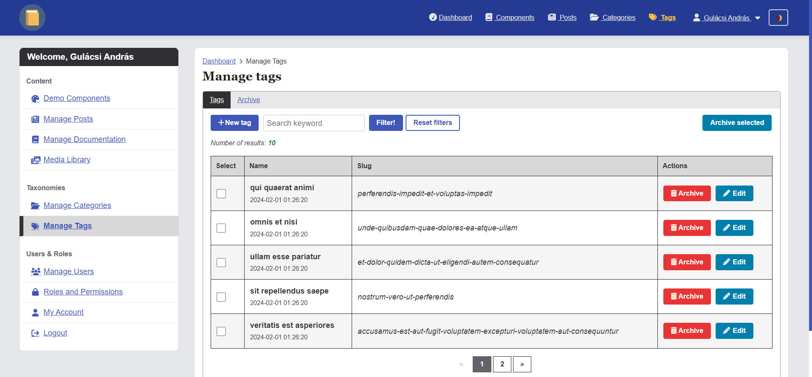

# Laravel Clean UI starter

**Laravel UI** provides a very simple authentication starter pack that is a far better starting point for my Laravel
apps
in my opinion. I prefer this over the bloated starter packs like Breeze, or Jetstream.

Laravel Clean.UI is a modification of the Laravel UI, where I removed Bootstrap and replaced it with my Clean.UI CSS
library with some extra JS codes. It is intended for a fullstack Laravel app with the usual blade templates/views, and
Livewire.

It includes a demo blog as an example with posts, post tags, post categories, and a documentation section (re-orderable docs
pages). However, it will not contain more
example codes to keep this starter slim.

In the project, I try to use good practices when organizing the codes (usage of service, and repository classes,
use clean code, etc.)

_Disclaimer: This project is under development, not 100% ready, but close._


## TODOs

- ~~TODO: Add the public-facing side of the demo blog, after the admin-side is finalized~~ -> DONE
- Create a better documentation
- ~~Check Laravel 11, and PHP 8.2 compatibility~~ -> DONE (but not yet merged to master)

The **laravel11** branch supports Laravel 11. Livewire was updated to version 3 (with all the necessary changes in components).
The application structure was not upgraded to the new Laravel 11 structure. As stated [in their upgrade guide](https://laravel.com/docs/11.x/upgrade#application-structure),

> However, **we do not recommend** (emphasis mine) that Laravel 10 applications upgrading to Laravel 11 attempt to migrate their application structure, as Laravel 11 has been carefully tuned to also support the Laravel 10 application structure.


## Screenshot




## Installation

**Recommended (new projects): Clone the repository or download as zip file.**

And go ahead with the usual steps.

- Install composer packages:

```bash
composer install
```

- Install npm packages:

```bash
npm install
```

Setup `.env` variables. Especially database and email settings. You need to have a local smtp server, and a user
interface to receive and view emails (account verification, 2fa code emails). For example, one solution is to
install [mailcatcher](https://mailcatcher.me/), or [PaperCut SMTP](https://www.papercut-smtp.com/) on your computer.

**These old steps below are not needed:**

_Only install it for new Laravel projects, because we will overwrite some files (and you may lose your changes you have
already made, e.g. vite.config.js, package.json)!_

1. Install Laravel

2. Install Laravel UI

```shell
composer require laravel/ui
# Generate login / registration scaffolding...
php artisan ui bootstrap --auth
```

3. Copy the `resources` folder over the `resources` folder in your project (overwrite all files)
4. Copy the `public` folder over the `resources` folder in your project (overwrite all files)
5. Overwrite `package.json` and `vite.config` file
6. Add `postcss.config.js` file
7. Add Composer dependencies (see the example config file). Install packages afterward
8. Install npm packages. Use your Laravel app as usual (npm run dev, php artisan serve)


## Important notes! - Updating laravel/ui

When updating `laravel/ui`, do not run `php artisan ui bootstrap --auth` again, because it will overwrite your custom
auth controllers and views!


## Laravel version compatibility

Laravel versions 9.x & 10.x (since the starter is based on laravel/ui 4.x) are supported. The starter has Laravel 10.x
support, but versions can be downgraded to Laravel 9.x.


## Other dependencies & configuration

**mews/purifier**, **tinymce**, and **alexusmai/laravel-file-manager** are installed.

- **mews/purifier**
  https://packagist.org/packages/mews/purifier

```bash
php artisan vendor:publish --provider="Mews\Purifier\PurifierServiceProvider"
```

To enable iframe-embed support for YouTube and Vimeo (can be extended for other video sharing platforms),
copy `_for_htmlpurifier/MyIframe.php` to `vendor/ezyang/htmlpurifier/library/HTMLPurifier/Filter/` folder. This line
should be present in `config/purifier.php` file (which is there by default in this starter):

```php
'Filter.Custom' => array (new HTMLPurifier_Filter_MyIframe()),
```

One disadvantage of this solution is that you can't cache config with this class instantiation present in the file.
Currently, I don't know any workaround to avoid this problem.

If you do not want to have these embeds enabled, remove this line from the config!

- **tinymce**
  https://www.tiny.cloud/docs/tinymce/6/laravel-tiny-cloud/

Copy the tinymce folder from inside `vendor/tinymce` folder to `public/assets`!

- **alexusmai/laravel-file-manager** https://github.com/alexusmai/laravel-file-manager

For file management the `alexusmai/laravel-file-manager` is used here. As an alternative, you can
replace it with `unisharp/laravel-filemanager` or with other packages.
Currently, the posts and the categories use the file manager, tags have a separate image upload implementation (TODO:
Use the file manager there as well).


## Credits

**Laravel UI**: Copyright (c) Taylor Otwell (MIT license).


## License

**Laravel Clean UI** is a modification / extension for the Laravel UI.

&copy; András Gulácsi 2023 - MIT license

